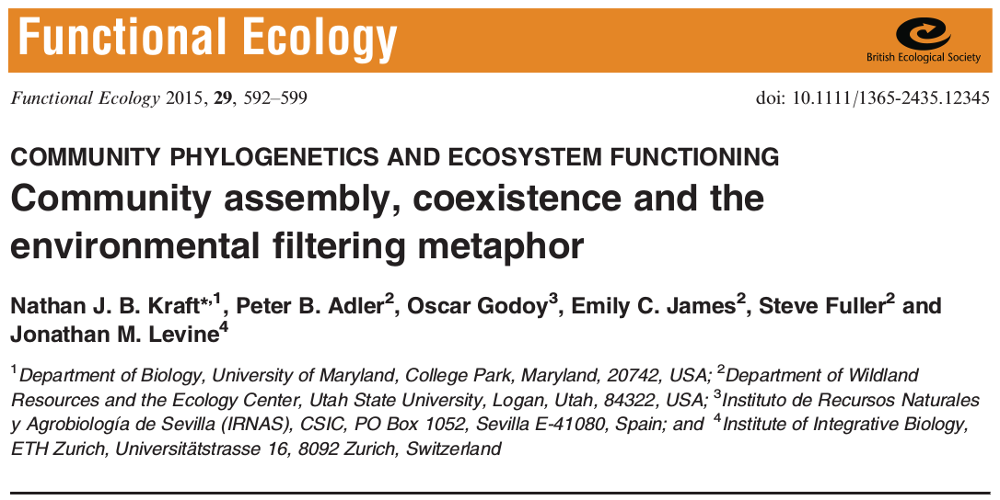
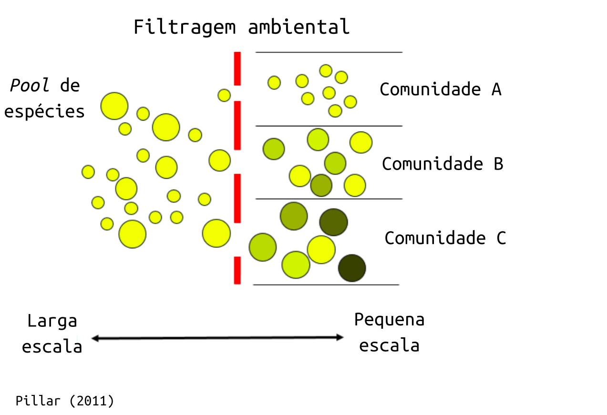
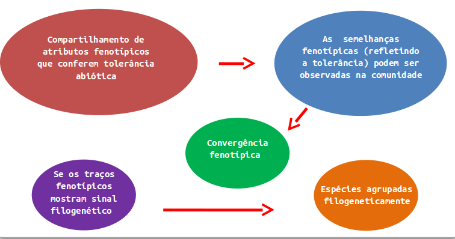
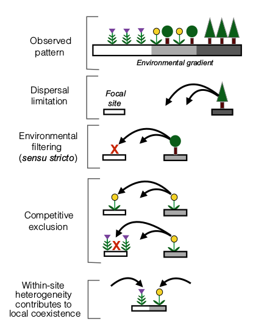
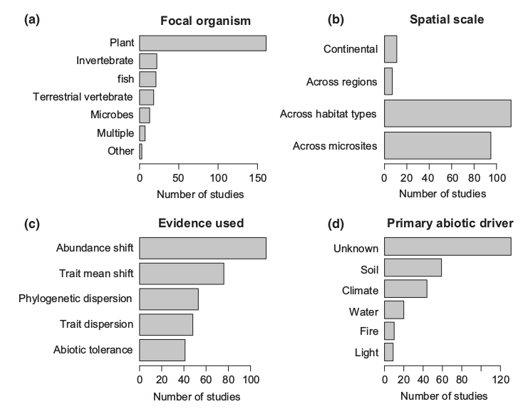

```{r knitr_setup, include=FALSE, cache=FALSE}

library(knitr)

### Chunk options ###

## Text results
opts_chunk$set(echo = FALSE, warning = FALSE, message = FALSE, eval = TRUE, size = 'footnotesize')

## Code decoration
opts_chunk$set(tidy = FALSE, comment = NA, highlight = TRUE, prompt = FALSE, crop = TRUE)

# ## Cache
opts_chunk$set(cache = TRUE, cache.path = "knitr_output/cache/")

# ## Plots
opts_chunk$set(fig.path = "knitr_output/figures/")
opts_chunk$set(fig.align = 'center')

### Hooks ###
## Crop plot margins
knit_hooks$set(crop = hook_pdfcrop)

## Reduce font size
# see http://stackoverflow.com/a/39961605
# knit_hooks$set(smallfont = function(before, options, envir) {
#   if (before) return(paste0("\n \\", options$size, "\n\n"))
#   else return("\n\n \\normalsize \n")
#   })

```

```{r out.width='5in', fig.align='center'}

```

# SUMÁRIO

## SUMÁRIO

- Discussão sobre o conceito histórico e atual de filtragem ambiental à luz da teoria de coexistência moderna

\vspace{0.5cm} <!-- espaços verticais -->

- Proposição de critérios para avaliação de filtragem ambiental

\vspace{0.5cm} <!-- espaços verticais -->

- Revisão da literatura sobre filtragem ambiental e estruturação de comunidades à luz dos critérios propostos

\vspace{0.5cm} <!-- espaços verticais -->

- Considerações para estudos futuros em estruturação de comunidades em função do ambiente

# CONTEXTUALIZAÇÃO

## CONTEXTUALIZAÇÃO

- Filtragem ambiental ou de hábitat: conceito recorrente na literatura ecológica

\vspace{0.5cm} <!-- espaços verticais -->

- O uso do conceito de filtragem ambiental tem suas raízes no estudo da montagem e dinâmica da comunidade vegetal no final de 1970 e início da década de 1980

\vspace{0.5cm} <!-- espaços verticais -->

- Meio ambiente como um "peneira" ou "filtro" que só permite espécies com características ou fenótipos específicos para se estabelecer e persistir, excluindo todos os outros 

# FILTRAGEM AMBIENTAL E A TEORIA DA COEXISTÊNCIA

## FILTRAGEM AMBIENTAL E A TEORIA DA COEXISTÊNCIA


- Ambiental 

- Abiótica 

- Habitat 


- Filtragem ambiental: relação de um organismo e o meio ambiente, reconhecendo que nem todos poderão se estabelecer e persistir com sucesso em todas as condições abióticas 

- Meio ambiente  visto como uma força seletiva, eliminando espécies incapazes de tolerar condições em um determinado local

# FILTRAGEM AMBIENTAL E A TEORIA DA COEXISTÊNCIA

## FILTRAGEM AMBIENTAL E A TEORIA DA COEXISTÊNCIA

- Espécies que são capazes de sobreviver em um local:

\begincols  
\begincol  


```{r out.width='3in', fig.align='left'}

```


\endcol

\begincol  

```{r out.width='3in', fig.align='left'}

```


\endcol
\endcols

# COMPREENSÃO DA COEXISTÊNCIA 

## COMPREENSÃO DA COEXISTÊNCIA 

O resultado da competição depende...

- Diferença de nicho (estabilizando a coexistência)

    - Espécies similares: exclusão competitiva
  
- Diferença nas médias de aptidão (determinando a dominância competitiva)

    - Dominância competitiva: diferenças na capacidade de espécies de extrair um recurso limitante ou tolerar um inimigo natural comum


# AGRUPAMENTO  DE CARACTERÍSTICAS FUNCIONAIS OU FILOGENÉTICAS EM UMA COMUNIDADE

## AGRUPAMENTO  DE CARACTERÍSTICAS FUNCIONAIS OU FILOGENÉTICAS EM UMA COMUNIDADE

- Pode resultar tanto da filtragem ambiental (fatores abióticos) quanto de processos competitivos


## FILTRAGEM AMBIENTAL E COEXISTÊNCIA: ALGUNS PROBLEMAS QUE PRECISAM SER CONSIDERADOS

- Grupos de espécies: o conceito de grupos de espécies que não conseguem persistir na comunidade raramente é considerado na teoria da coexistência

- Separação de fatores abióticos e bióticos: 

    - A detecção verdadeira da filtragem pode exigir estudos de tolerância na ausência de outras espécies que interagem


- Dependência da escala:  

    - Identificação de  espécies que possam estar presentes em uma área (via dispersão), mas não estão

    - É necessário tem cuidado com a escala espacial na definição de grupos de potenciais espécies presentes na área


# UM FRAMEWORK PARA O ESTUDO DE FILTRAGEM AMBIENTAL


## QUANTIFICANDO O PAPEL DO AMBIENTE

- Conceito original

    - Fatores ambientais impedem que a espécie se estabeleça ou persista em determinado local

- Problema

    - Influência dos processos biológicos
    - Competição, ausência de polinizadores, predação

- Resultado

    - “Filtro Ambiental” como termo genérico usado para descrição de qualquer influência abiótica percebida

- Proposta

    - “Filtro Ambiental sensu stricto”
        
        - Usar somente quando a falha de persistir num local seja devido apenas a fatores abióticos

# GUIA PRÁTICO

## GUIA PRÁTICO

- Passo a passo para guiar os estudos que considerem os filtros ambientais

    1. Definir a escala
    2. Documentar o potencial de chegada da espécie
    3. Quantificar a sobrevivência na ausência de outras espécies
    4. Quantificar a persistência no meio biótico
    5. Considerar influências abióticas adicionais

## 1 - DEFINIR A ESCALA

- Boa definição da escala da comunidade em estudo

    - Melhor interpretação dos resultados

    - Contabilizar de maneira correta o papel da heterogeneidade ambiental no processo de filtragem

- Pool de espécie geograficamente menor

    - Provavelmente diminui a força do filtro ambiental

    - Homogeneidade das condições ambientais

- Comunidade local geograficamente maior

    - Provavelmente diminui a força do filtro ambiental

    - Maior heterogeneidade de habitats permite maios colonização

    - Também permite maior coexistência de espécies

## 1 - DEFINIR A ESCALA

- Filtro Ambiental sensu stricto

    - Mais forte

        - Pool de espécies é retirado de uma grande área contendo uma grande heterogeneidade abiótica

        - Comunidade local restrita e abioticamente homogênea.

## 2 - DOCUMENTAR O POTENCIAL DE CHEGADA DA ESPÉCIE

- Quantificar a chegada de indivíduos ao local

- Inferir se o indivíduo pode chegar ali

    - Proximidade entre os locais

    - Distância de dispersão da espécie

- Ela não está ali por causa dos filtros ambientais ou porque não consegue chegar?

## 3 - QUANTIFICAR A SOBREVIVÊNCIA NA AUSÊNCIA DE OUTRAS ESPÉCIES

- Remoção das espécies

    - Espécies competidoras

    - Mas também espécies facilitadoras

- Observar se sobrevive

- Caso não:

    - “Filtro Ambiental sensu stricto”

    - Impossibilidade da espécie, que consegue chegar ao local, tolerar as condições ambientais na ausência de outras espécies

## 4 - QUANTIFICAR A PERSISTÊNCIA NO MEIO BIÓTICO

- Com relação a competição

    - Através de invasões experimentais

- Pode ser importante quantificar interações positivas

    - Podem aumentar a performance

    - Permitir a persistência da espécie

## 5 – CONSIDERAR INFLUÊNCIA  FATORES ABIÓTICOS ADICIONAIS

- Heterogeneidade dos habitats


## UM FRAMEWORK PARA O ESTUDO DE FILTRAGEM AMBIENTAL

\begincols
\begincol

```{r out.width='2.2in', fig.align='center'}

```


\endcol

<!-- \right -->

\begincol

1. Definir a escala

2. Documentar o potencial de chegada da espécie

3. Quantificar a sobrevivência na ausência de outras espécies

4. Quantificar a persistência no meio biótico

5. Considerar influência de fatores abióticos adicionais


\endcol

\endcols

# REVISÃO DA LITERATURA À LUZ DOS CRITÉRIOS PROPOSTOS

## REVISÃO DA LITERATURA À LUZ DOS CRITÉRIOS PROPOSTOS

\begincols
\begincol

```{r out.width='3in', fig.align='center'}

```


\endcol

<!-- \right -->

\begincol

- ‘environment\* filter\*’ ou ‘habitat filter\*’

- 258 artigos entre 1992 e 2013

- Evidências de filtragem *sensu stricto* apenas em 15% dos artigos

- Ausência de estudos sobre tolerância fisiológica

\endcol

\endcols

# O FUTURO DO CONCEITO DE FILTRAGEM AMBIENTAL

## O FUTURO DO CONCEITO DE FILTRAGEM AMBIENTAL

- Precisão no uso do termo *filtragem ambiental*
    - Necessidade/dificuldade de obtenção de dados
    
\vspace{0.5cm} <!-- espaços verticais -->

- Dependência de evidências alternativas:
    - Mudanças nas abundâncias ou nos valores médios dos atributos ao longo de gradientes
    - Agrupamento funcional/filogenético em relação ao banco regional

\vspace{0.5cm} <!-- espaços verticais -->

- Distinção entre tolerância às condições ambientais e diferenças de *fitness*
    - Implicações para conservação frente às mudanças no clima
    - Problema: atributo associado à tolerância gera *trade-off* entre crescimento e reprodução, e pode diminuir a habilidade competitiva

# O VALOR DOS DADOS OBSERVACIONAIS

## O VALOR DOS DADOS OBSERVACIONAIS

\begincols

\begincol

```{r out.width='2.2in', fig.align='center'}

```

\endcol

\begincol

- Filtragem ambiental
    - Diferenças ambientais entre a área de estudo e áreas do entorno
    - Mudanças nas abundâncias ao longo de gradientes *extremos*

\vspace{0.5cm} <!-- espaços verticais -->

- Diferenças no *fitness* + filtragem ambiental
    - Mudanças nas abundâncias ao longo de gradientes *modestos* em pequenas escalas

\endcol
\endcols

# CONCLUSÕES

## CONCLUSÕES

<!-- \begin{flushright} -->

- Restringir o uso do conceito de filtragem ambiental
    - Estabelecimento e persistência
    
\vspace{0.5cm} <!-- espaços verticais -->    


- Mais atenção às condições locais (grão do estudo)
    - Heterogeneidade interna
    - Interações bióticas


<!-- \end{flushright} -->

# OBRIGADA 

<!--INÍCIO: NOTAS TÉCNICAS------------------------------------------------------

## notes

```{r out.width='4in', out.height='3in', fig.}
include_graphics("images/3D-1.png")
```


https://tex.stackexchange.com/questions/24599/what-point-pt-font-size-are-large-etc


Command             10pt    11pt    12pt
\tiny               5       6       6
\scriptsize         7       8       8
\footnotesize       8       9       10
\small              9       10      10.95
\normalsize         10      10.95   12
\large              12      12      14.4
\Large              14.4    14.4    17.28
\LARGE              17.28   17.28   20.74
\huge               20.74   20.74   24.88
\Huge               24.88   24.88   24.88


\begincols  
\begincol  
 

\endcol

\begincol  


\endcol
\endcols


----FIM: NOTAS TÉCNICAS-------------------------------------------------------->
